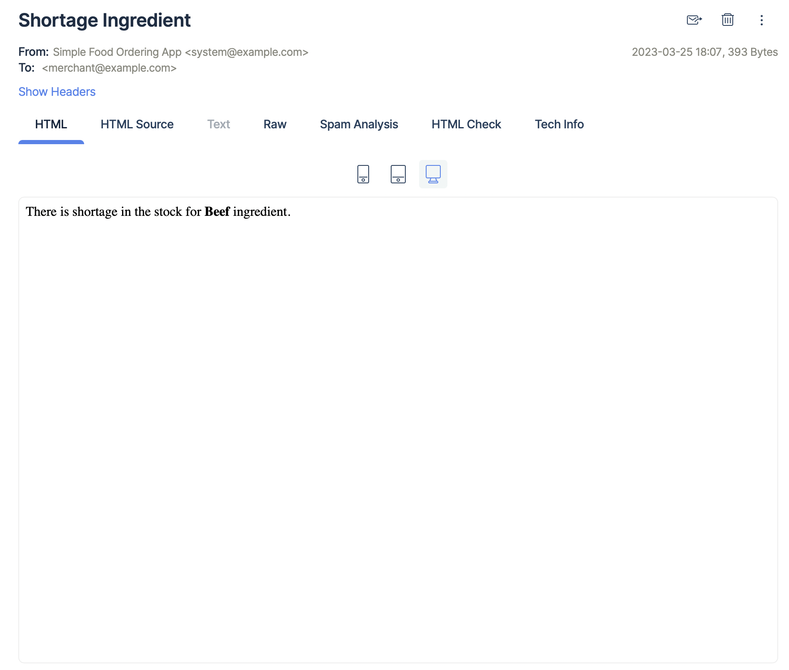
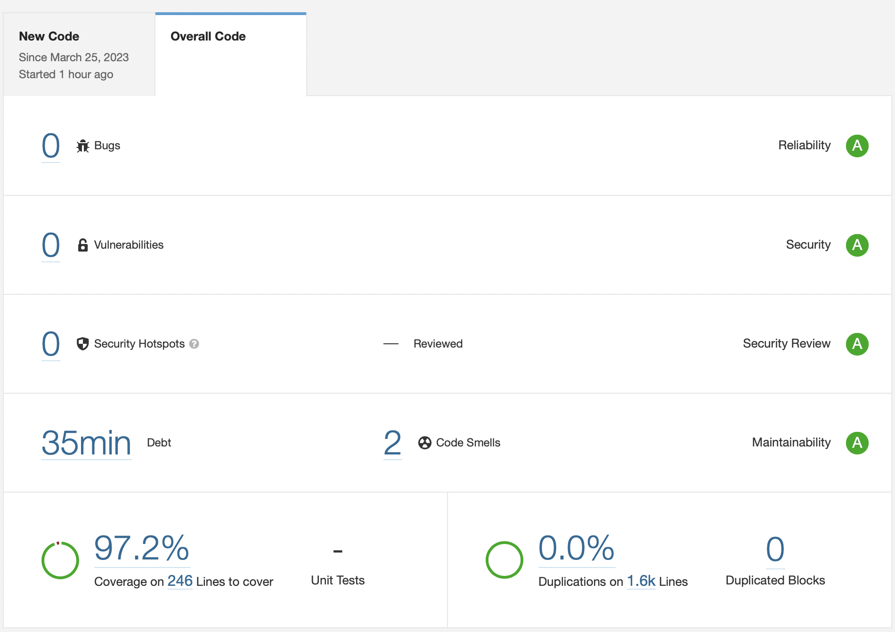

### Simple Food Ordering App:
* A simple food ordering system in which you can use it to order the food that you want to eat!
* The app is built on Laravel and [Laragine](https://github.com/yepwoo/laragine)

Here is an example email that's being sent when any ingredients reaches certain level in the stock:



## Trade-offs
if I was to spend additional time on the project I would do the following:
* Use Docker
* Use Kubernetes
* Make the `uom_converter` helper function (core/Inventory/helpers.php) more scalable as it's currently coupled to 2 units (g & kg)
* Handle unforeseen circumferences, ex: what about creating an order that should have ingredients that have more quantity than the ingredients in the stock ?

### Getting started:
* You do not have a `.env` file in the project root directory so copy `.env.example` and save it as `.env`
* In `.env` file update the database info and the other credentials like `API_KEY`, `LOG_SLACK_WEBHOOK_URL` and `MERCHANT_EMAIL` (used to send the alerting emails to)
* Open the terminal and navigate to the project directory and run `composer install`
* Generate the application key using `php artisan key:generate`
* Create the database tables by running `php artisan migrate --seed`
* You will need to keep the `queue` running in the background, so this command needs to be always running `php artisan queue:work`

## Testing & Development

Here is the quality of the code measured by SonarQube:



* You can run **SonarQube** by copying `sonar-project.properties.example` and saving it as `sonar-project.properties` and then update all the info, and after that you can run the following:

```
sonar-scanner
```

* You can run the tests by running `php artisan test` (UI friendly) or `vendor/bin/phpunit`

* You can check out the API docs from here: [API Documentation](https://documenter.getpostman.com/view/6359426/2s93RNyaTY)